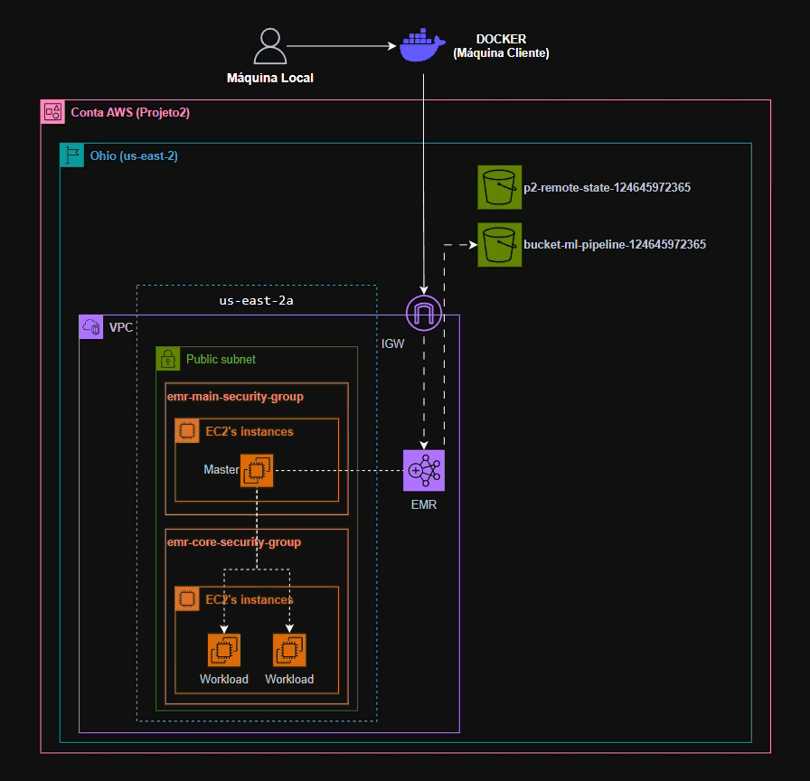

# Projeto2-IaC-para-Treinamento-Distribuido-de-ML-com-PySpark-AWS-EMR
O Projeto 2 foca na implementação e no deploy de um stack avançado de treinamento distribuído de Machine Learning utilizando PySpark no Amazon Elastic MapReduce (EMR). O objetivo é aproveitar o processamento distribuído para treinar modelos de Machine Learning em larga escala, otimizando o uso de recursos e reduzindo o tempo necessário para o treinamento.

---
## 📂 Estrutura do Projeto
```bash
Projeto2/
├── IaC/                           # Diretório principal de Infraestrutura como Código
│   ├── dados/
│   │   └── dataset.csv            # Dados de entrada (Raw Data)
│   ├── modules/                   # Módulos reutilizáveis do Terraform
│   │   ├── emr/                   # Configuração do Cluster EMR
│   │   │   ├── iam.tf             # Definição de Roles e Políticas de Acesso
│   │   │   ├── main.tf            # Definição dos recursos do cluster
│   │   │   └── security_groups.tf # Regras de Firewall
│   │   └── s3/                    # Configuração de Armazenamento
│   │       ├── main.tf            # Criação dos Buckets
│   │       └── outputs.tf         # Outputs (nome do bucket criado)
│   ├── pipeline/                  # Scripts de Processamento e Machine Learning
│   │   ├── p2_log.py              # Gerenciamento de Logs
│   │   ├── p2_ml.py               # Script de modelagem/ML
│   │   ├── p2_processamento.py    # Script de processamento de dados
│   │   └── projeto2.py            # Script principal de execução
│   ├── scripts/
│   │   └── bootstrap.sh           # Script de inicialização (Bootstrap Actions para o EMR)
│   ├── config.tf                  # Configurações do Provider/Backend para o Estado Remoto, Versão do Terraform e Provider
│   ├── main.tf                    # Orquestrador principal da infraestrutura
│   ├── terraform.tfvars           # Definição dos valores das variáveis
│   └── variables.tf               # Declaração das variáveis
├── .gitattributes
├── .gitignore
├── Dockerfile                     # Ambiente Docker reprodutível
├── LEIAME.txt                     # Instruções adicionais
├── LICENSE
└── README.md                      # Documentação oficial
```

---
## ☁️ Diagrama de Arquitetura do Projeto

---